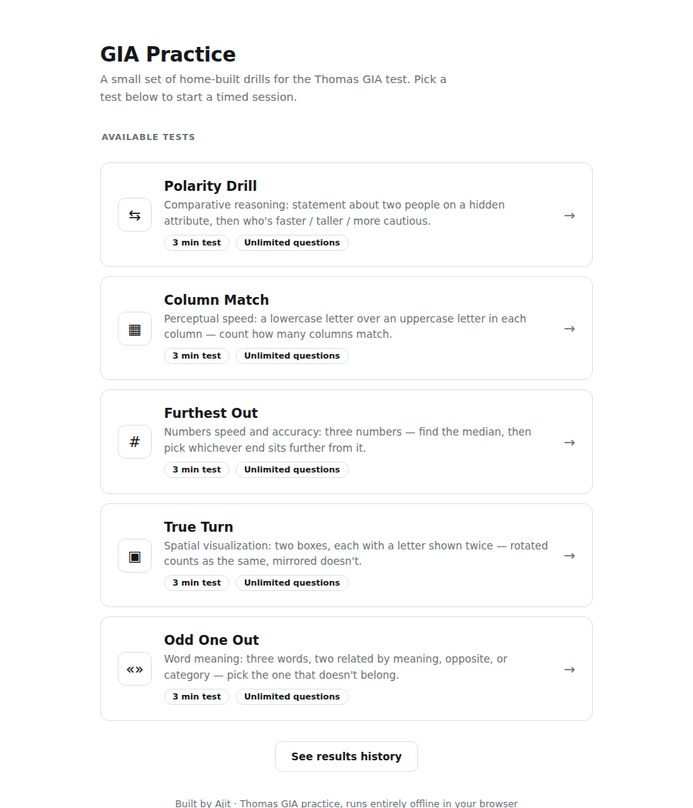
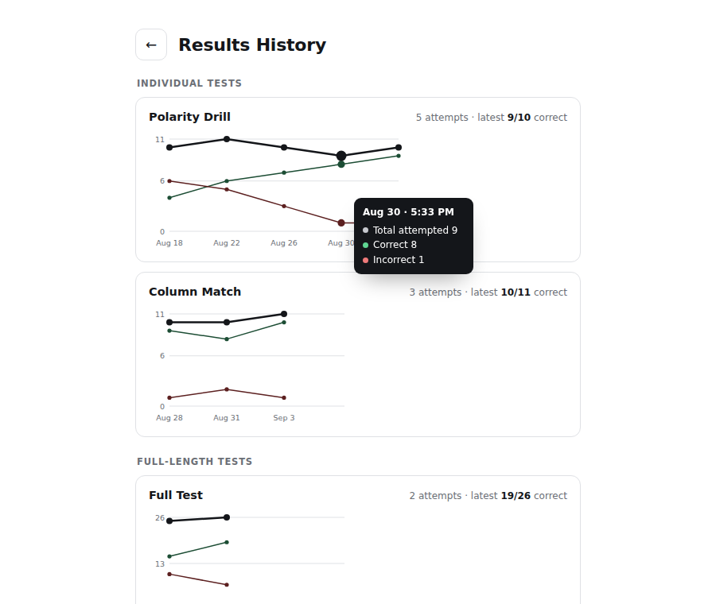

<div align="center">


# gia-practice


*A single-file, offline practice suite for the Thomas GIA assessment — five timed drills, each built and verified question-by-question against the official example booklet, with results saved locally across sessions.*

[**Tests**](#tests) •
[**Features**](#features) •
[**Results history**](#results-history) •
[**Running it locally**](#running-it-locally) •
[**Project structure**](#project-structure) •
[**Disclaimer**](#disclaimer)

<br />

---



</div>

---

## Tests

All five run as timed, 3-minute drills with unlimited questions — answer as many as you can before the clock runs out.

| Test | Section | Format |
|---|---|---|
| **Polarity Drill** | Reasoning | A statement compares two people on a hidden attribute (`Elias is not as slow as Priya.`), then asks who holds a related property (`Who is quicker?`). Pick one of two names. |
| **Column Match** | Perceptual Speed | Four columns, each showing a lowercase letter over an uppercase letter. Case doesn't matter — count how many columns match (0–4). |
| **Furthest Out** | Numbers Speed & Accuracy | Three numbers. Find the median, then decide whether the highest or lowest value sits further from it. |
| **True Turn** | Spatial Visualization | Each question shows 2–4 boxes, each with a letter shown twice. A rotated copy still counts as a match; a mirrored copy never does, however it's rotated. |
| **Odd One Out** | Word Meaning | Three words — two share a meaning, an opposite, or a category, and one doesn't belong. Pick the odd one out. |

## Features

- **Single-page app** — the hub, all five tests, and results history live in one `index.html`. Switching between them is instant (no page reloads), and leaving a test mid-session stops its timer and resets it cleanly.
- **Full Test mode** — runs all 5 sections back-to-back in the real GIA order (3 minutes each, no mixing between topics), with a short transition screen between sections and a combined score summary at the end.
- **Results history with interactive charts** — every completed run is saved to `localStorage` (capped at 200 entries). See [Results history](#results-history) below.
- **Format-verified content** — every question type, vocabulary level, and number range was checked against Thomas International's own [GIA example booklet](https://www.thomas.co/sites/default/files/2020-04/GIA_Example_Booklet.pdf) rather than invented — no "Cannot be determined" options, no multi-statement chains, no SAT-word vocabulary, nothing that doesn't appear in the real test.
- **Deterministic generation** — every test decides the correct answer first (as signed values / booleans), then renders a question to match it, so there's never a case where the displayed question and the stored answer can disagree.
- **Zero dependencies** — no build step, no bundler, no external requests at runtime. Open the file and it works.

## Results history

Every completed run — a single test or a full-length one — is saved locally and plotted as a trend line, so you can see whether you're actually improving.



- **Three lines per test**: total questions attempted, correct, and incorrect, plotted against attempt date, so speed and accuracy trends are both visible at a glance.
- **Full-length runs get their own category** — a Full Test attempt shows up separately from solo test runs, alongside a section-by-section breakdown.
- **Hover any point** for the exact numbers on that attempt (correct/incorrect count, and the per-section scores for a Full Test run).
- Hand-rolled as plain SVG — no charting library — so the whole app stays dependency-free and works offline.

## Running it locally

There's nothing to install or build.

```bash
git clone https://github.com/<your-username>/gia-practice.git
cd gia-practice
open index.html   # or just double-click it
```

It also works as a static [GitHub Pages](https://pages.github.com/) site — enable Pages on this repo (Settings → Pages → Deploy from a branch → `main` / root) and it serves directly from `index.html`, no build step required.

## Project structure

```
gia-practice/
├── index.html      # the entire app — hub, all 5 tests, Full Test mode, results history
├── assets/
│   ├── icon.png
│   ├── screenshot.png
│   └── history-screenshot.png
└── README.md
```

## Disclaimer

This is an unofficial, fan-built practice tool made to help prepare for the Thomas International GIA assessment. It is not affiliated with, endorsed by, or sponsored by Thomas International, and none of its content is copied from the real test — every question format was independently reconstructed from publicly available example material.

---

<div align="center">

Built by Ajit

</div>
